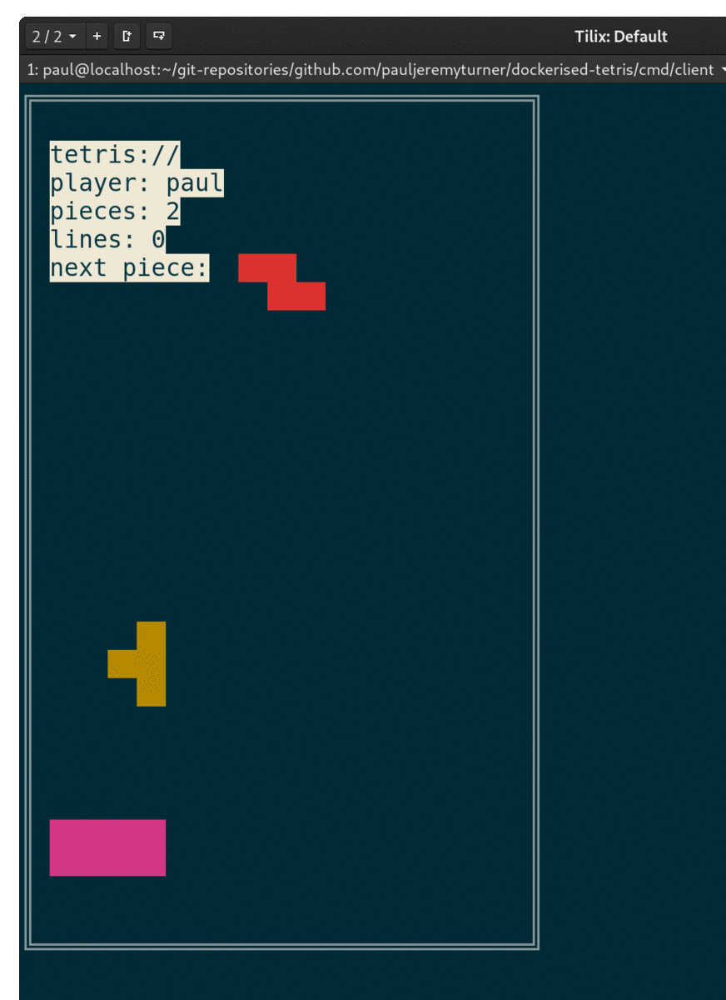

# dockerised-tetris
A terminal client communicates with a Tetris game engine.

## What is this?
An implementation of the classic Tetris game.  The game engine sends pixel information to the client.
The client is stupid.  It only paints pixels by co-ordinates and colour.

Client-server communication is via google protobuf streaming.

## How do I make it work

First build the docker container:

`docker build -t tetris .`

Then run the container:

`docker run -p 50051:50051 tetris`

Then run the game client

`go run client-main.go`

## How do I play?

`s, d` Left & right move
`a, f` Left & right rotate
`x` Move down
`e` Drop

## Work in progress

DT-1
~~basic project setup.  A modular golang project.  server: a docker container that can server new tetris board requests, client: a protobuf client to send new tetris board request~~
DONE

DT-2
~~build a UI that can be updated with board updates and register key presses for user moves.  Add dockerfile for server process~~
DONE

DT-3
~~enable protobuf streaming for stubbed game state updates to be displayed on UI~~
DONE

DT-4
~~implement matrix algebra for piece rotations, provide a way to define coordinates of pieces~~
DONE
